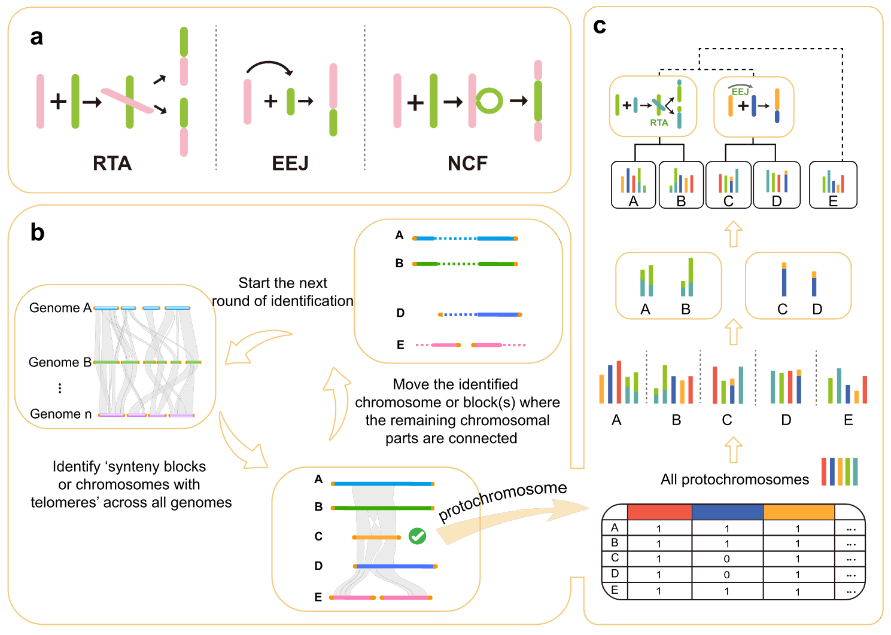

### What is Karyotype Evolution?

Karyotype comprises both chromosome numbers and character of each chromosome for one species. Karyotype evolution represents chromosomal changes from the ancestral genome to the modern genome. This information is critical for reconstructing ancestral karyotypes and tracing how modern species evolved step by step. The evolution of ancestral karyotypes, especially involving changes in the number of chromosomes, usually results in speciation with rapid reproductive isolation. However, in the long evolutionary history of the karyotype of one current species, ancestral chromosomes fusion or fission gradually and randomly in the offspring lineages. This means that each intact ancestral chromosome (protochromosome) could be retained across the highly diverged lineages. In addition, the lineage closer to the common ancestor with fewer genome changes (for example, whole-genome duplication, WGD) may retain more protochromosomes than those distantly related ones with more WGD. If one protochromosome fused with another to produce one new chromosome or fissioned into two new chromosomes, the syntenic blocks could be identified as a basic rule. The other basic rule for such an ancestral karyotype should be that all protochromosomes or their syntenic blocks correspond completely to all chromosomes of each offspring species.

### The method to identify ancestral karyotypes

The previous approaches for karyotype reconstruction define contiguous ancestral regions (CARs) based on collinearity. However, due to chromosome structural abnormalities and short syntenic blocks, undefined regions become gap regions and the final result is highly dependent on the input files and parameters. In addition, a large number of gap regions in the results cannot continue to explore chromosomal changes. Different from these previous methods, we identify the protochromosomes by searching the shared intact chromosomes or chromosome-like syntenic blocks during chromosomal fusions across the highly diverged lineages. During chromosomal fusions, chromosome-like syntenic blocks are retained, in which chromosomes are protected by telomeres, and the fused chromosomes, therefore, have telomeres. However, it should be noted that our method did not exclude the chromosomal fissions, in which one protochromosome produced two chromosomes. Under this scenario, we can identify this protochromosome in other lineages, which may be intactly retained or fused with other protochromosomes. We summarize karyotypic changes during three basic chromosomal fusion types and also processes that we used to identify protochromosomes for ancestral angiosperm karyotype.

###### Karyotype evolution model and uniqueness of chromosomal fusions

Three basic chromosomal fusions comprise reciprocally translocated chromosome arms (RTA), end-end joining (EEJ) and nested chromosome fusion (NCF) (Fig.1). Chromosome translocations include reciprocal translocation and Robertsonian translocation, which correspond to RTA and EEJ, respectively. The NCF pattern is also widely recognized and used (Celebrating Mendel, McClintock, and Darlington: On end-to-end chromosome fusions and nested chromosome fusions. The Plant Cell. doi: 10.1093/plcell/koac116, 2022).

[Figure 1]:  Three basic chromosomal fusion

Although chromosomal structural variations occur frequently in genomes, the probability seems to be very low that the positions of protochromosome fusion happen to overlap with the breakpoints of further structural variations at the later evolutionary stage. Therefore, such fusion positions could be accurate to infer whether two lineages share the same ancestor or not. Similarly, the inversion often occurs during chromosomal evolution, it is nearly impossible to disrupt the positions of protochromosome fusion. So, inversions have little effect on karyotype reconstruction.

Chromosomal fission usually refers to when one protochromosome breaks into two or more independent chromosomes. The RTA defined above comprises special chromosomal fission. Other chromosomal fission was not considered here because of two reasons. First, WGD is common in plants and chromosomal fusions occur more frequently after WGD. Second, if protochromosomal fission occurs in one lineage, for example, breaking into chromosomes, the identification of this protochromosome could be replaced by other lineages in which it may have remained intact or fused with other protochromosome with chromosome-like syntenic blocks. In addition, two fissioned chromosomes also correspond to syntenic blocks, which could be identified and deleted during the second cycle of the protochromosome identification.

###### Basic steps for construction of ancestral chromosome karyotype and karyotypic evolution

Four steps were undertaken to construct the ancestral karyotype(Fig.2a-b). First, identifying chromosome-like ‘synteny blocks’ and small synteny blocks across all sampled genomes. Second, exploring the shared ‘synteny block’ with telomeres (chromosome-like) and the intact chromosome across extant genomes and extracting the most intact of these (for example, one chromosome) as one protochromosome. Third, deleting this shared block and its syntenic small blocks across all extant genomes and connecting the remaining parts together as ‘entire chromosomes’. Fourth, starting one more round of ‘synteny exploration’ to extract all protochromosomes until no genomic block was left for each extant genome.

[Figure 2]: According to the three basic chromosomal fusion types (a), one outlined identification of protochromosomes based on the shared chromosomes or chromosome-like syntenic blocks across the highly diverged lineages (b) and determination of the phylogenetic relationships and karyotypic evolution for the common ancestor (c).

All protochromosomes of the ancestral karyotype are compared with each extant genome and the karyotypic composition from the protochromosomes is determined. According to fusion and fission positions between protochromosomes of the ancestral karyotype and chromosomes of the current species, the karyotypic changes and phylogenetic relationships are inferred (Fig. 2c).

### Karyotype reconstruction demonstration

The detailed process is at https://github.com/SunPengChuan/wgdi-example/.

### What can Karyotype Evolution be used for?

(1) Paleogenomics and exploring the evolutionary trajectories of species.

(2) Phylogenetic and Species Taxonomy.

(3) Helps in verifying genome assembly.

(4) Detection of autopolyploidy or allopolyploidy.

